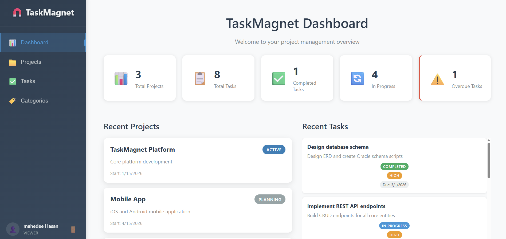

# TaskMagnet

**TaskMagnet** is a full-stack project and task management application built with Spring Boot and React. It provides JWT-based authentication, role-based access control, and a complete workflow for managing projects, tasks, and categories.

---



## Technology Stack

### Backend
| Technology | Version |
|---|---|
| Java | 21 |
| Spring Boot | 3.4.3 |
| Spring Security | 6.x (stateless JWT) |
| JJWT | 0.12.6 |
| Oracle XE | 21c |
| Maven | 3.9+ |

### Frontend
| Technology | Version |
|---|---|
| React | 19.1.1 |
| TypeScript | 5.7.3 |
| Vite | 6.0.11 |
| React Router | 6.30.0 |
| Axios | 1.7.9 |

---

## Features

- **Authentication** — JWT login and signup with `ROLE_ADMIN`, `ROLE_USER`, `ROLE_MODERATOR`
- **Dashboard** — Live summary of projects, tasks, and categories
- **Project Management** — Create, edit, and delete projects with status lifecycle (`PLANNING → ACTIVE → COMPLETED`)
- **Task Management** — Kanban board with columns: `NOT_STARTED`, `IN_PROGRESS`, `IN_REVIEW`, `ON_HOLD`, `COMPLETED`
- **Category Management** — Create, edit, and delete categories; assign to projects and tasks
- **User Management** — View and manage users; role assignments

---

## Project Structure

```
TaskMagnet/
├── src/
│   ├── backend/
│   │   └── taskmagnet-web/          # Spring Boot application
│   │       ├── src/main/java/com/taskmagnet/
│   │       │   ├── controller/
│   │       │   ├── service/
│   │       │   ├── dto/
│   │       │   ├── entity/
│   │       │   └── security/
│   │       └── pom.xml
│   └── frontend/
│       └── taskmagnet-frontend/     # Vite + React application
│           ├── src/
│           │   ├── components/
│           │   ├── contexts/
│           │   ├── pages/
│           │   ├── services/
│           │   └── types/
│           └── package.json
└── docs/
```

---

## Prerequisites

- Java 21+
- Maven 3.9+
- Oracle XE 21c
- Node.js 18+

---

## Setup and Running

### 1. Clone the Repository

```bash
git clone https://github.com/mahedee/TaskMagnet.git
cd TaskMagnet
```

### 2. Database Setup (Oracle XE)

Connect to Oracle XE as `SYSDBA` and run:

```sql
CREATE USER taskmagnet IDENTIFIED BY "yourpassword";
GRANT CONNECT, RESOURCE, DBA TO taskmagnet;
```

Or run the provided script:

```bash
# File: src/sql/CREATE_USER_taskmagnet.sql
```

### 3. Configure Backend

Edit `src/backend/taskmagnet-web/src/main/resources/application.properties`:

```properties
spring.datasource.url=jdbc:oracle:thin:@localhost:1521/XE
spring.datasource.username=taskmagnet
spring.datasource.password=yourpassword
```

### 4. Build and Run the Backend

```bash
cd src/backend/taskmagnet-web
mvn clean package -DskipTests
java -jar target/taskmagnet-1.0.0.jar
```

Backend runs at: **http://localhost:8080**

### 5. Install and Run the Frontend

```bash
cd src/frontend/taskmagnet-frontend
npm install
npm run dev
```

Frontend runs at: **http://localhost:3000**

---


## API Overview

Base URL: `http://localhost:8080/api`

| Endpoint | Description |
|---|---|
| `POST /auth/login` | Authenticate and receive JWT |
| `POST /auth/register` | Register a new user |
| `GET /projects` | List all projects |
| `POST /projects` | Create a project |
| `GET /tasks` | List all tasks |
| `POST /tasks` | Create a task |
| `GET /categories` | List all categories |
| `POST /categories` | Create a category |
| `GET /users` | List all users (admin) |

Interactive API documentation (Swagger UI): **http://localhost:8080/swagger-ui/index.html**

