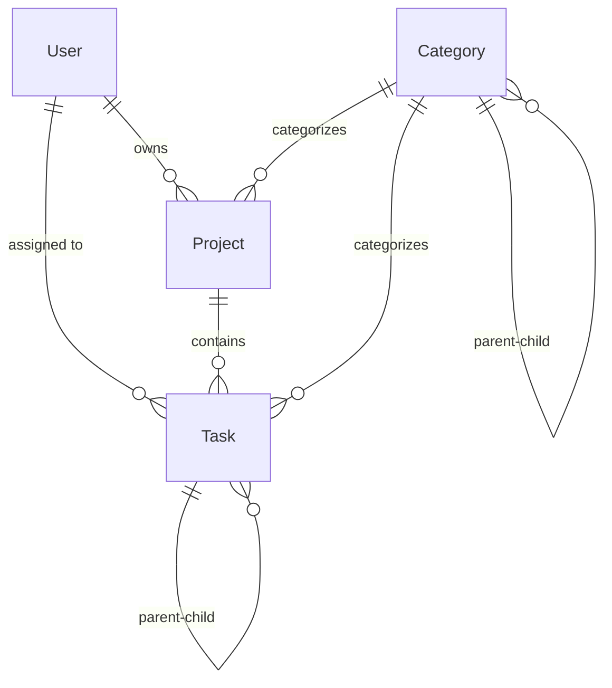

# TaskMagnet - Enterprise Project Management System
**Modular Monolith Architecture with Advanced Task & Project Management**

        

**TaskMagnet** is an enterprise-grade project management and task tracking system built with a **modular monolith architecture**. It provides comprehensive project lifecycle management, advanced task workflows, and enterprise security features.

> 🔥 **Production-Ready Foundation Complete!** The core architecture, database schema, and security implementation are fully operational. Frontend development is the next phase.

> ⭐ **If you find this project useful, please give it a star!** Your support helps us grow the community.

---

## 🎯 **Current Implementation Status**

### ✅ **Completed Features (v3.0.0)**
- **🏗️ Modular Monolith Architecture**: Multi-module Maven structure with clear domain boundaries
- **🗄️ Enterprise Database Schema**: Complete JPA entity model with Oracle XE integration
- **🔒 JWT Security Framework**: Role-based authentication with Spring Security 6.x
- **📊 Comprehensive Repository Layer**: 130+ custom queries across 4 domain repositories
- **🚀 Developer Tooling**: Multi-platform application scripts and comprehensive documentation
- **📚 API Documentation**: Complete Swagger/OpenAPI integration
- **🧪 Testing Framework**: Full test coverage with unit and integration tests

### 🚧 **In Development (Next Phase)**
- **⚛️ React Frontend**: TypeScript-based SPA with JSON repository for rapid prototyping
- **🔌 REST API Controllers**: Complete CRUD operations for all domain entities
- **🎨 UI/UX Design System**: Modern, responsive interface with advanced workflows

---

## 🧰 **Technology Stack**

### **Backend (Production Ready)**
- **Framework**: Spring Boot 3.1.5 with Java 17+
- **Database**: Oracle XE 21c with HikariCP connection pooling
- **Security**: Spring Security 6.x with JWT authentication
- **API Documentation**: Swagger/OpenAPI 3.x
- **Build System**: Maven multi-module structure
- **Testing**: JUnit 5, AssertJ, Spring Boot Test

### **Frontend (In Development)**
- **Framework**: React 18+ with TypeScript
- **State Management**: Context API / Redux Toolkit
- **Routing**: React Router v6
- **HTTP Client**: Axios with interceptors
- **UI Library**: Material-UI / Ant Design
- **Build Tool**: Vite / Create React App

### **Infrastructure**
- **Application Server**: Embedded Tomcat
- **Database**: Oracle XE (Development), Oracle Enterprise (Production)
- **Authentication**: JWT tokens with configurable expiration
- **Documentation**: Comprehensive JavaDoc and Swagger

---

## 🚀 **Quick Start Guide**

### **Prerequisites**
- **Java 17+** (OpenJDK or Oracle JDK)
- **Maven 3.6+** 
- **Oracle XE 21c** (or Oracle Database)
- **Git** for version control

### **1. Clone Repository**
```bash
git clone https://github.com/mahedee/TaskMagnet.git
cd TaskMagnet
```

### **2. Database Setup**
```sql
-- Create user and schema in Oracle
CREATE USER taskmagnet IDENTIFIED BY "mahedee.net";
GRANT CONNECT, RESOURCE, DBA TO taskmagnet;
```

### **3. Run Application**
```powershell
# Windows PowerShell (Recommended)
.\run-app.ps1

# Linux/macOS
chmod +x run-app.sh
./run-app.sh

# Windows Command Prompt
run-app.bat

# Quick start with defaults
.\start.ps1
```

### **4. Access Application**
- **Application**: http://localhost:8081
- **Swagger UI**: http://localhost:8081/swagger-ui.html
- **API Docs**: http://localhost:8081/api-docs

### **5. Default Credentials**
```
Username: admin
Password: Taskmagnet@2025
Email: admin@gmail.com
```

---

## 🏗️ **Architecture Overview**

### **Modular Monolith Design**
```
TaskMagnet/
├── src/backend/
│   ├── taskmagnet-core/          # Domain entities, repositories, business logic
│   └── taskmagnet-web/           # Web controllers, security, API layer
├── src/frontend/                 # React application (in development)
└── docs/                         # Comprehensive documentation
```

### **Domain Model**


### **Security Architecture**
- **Authentication**: JWT tokens with configurable expiration
- **Authorization**: Role-based access control (USER, MODERATOR, ADMIN)
- **Password Security**: BCrypt hashing with salt
- **API Security**: Method-level and URL-level protection
- **Audit Trail**: Comprehensive tracking of all data changes

---

## 📊 **Key Features**

### **User Management**
- ✅ Complete user registration and authentication
- ✅ Role-based access control with hierarchical permissions
- ✅ Account security features (lockout, password reset)
- ✅ Comprehensive audit trail and activity tracking

### **Project Management** 
- ✅ Project lifecycle management with status tracking
- ✅ Team member assignment and collaboration
- ✅ Progress tracking and reporting
- ✅ Category-based organization with hierarchy

### **Task Management**
- ✅ Advanced task workflows with status transitions
- ✅ Priority levels and due date management  
- ✅ Hierarchical task structure (parent-child relationships)
- ✅ Time tracking and billable hours support

### **Data Architecture**
- ✅ Complete JPA entity model with relationships
- ✅ 130+ custom repository methods for advanced queries
- ✅ Comprehensive business logic and validation
- ✅ Oracle database optimization and indexing

---

## 🛠️ **Development Scripts**

### **Application Runner Scripts**
```powershell
# Full-featured PowerShell script
.\run-app.ps1 -Port 8080 -Profile prod -Clean

# Cross-platform shell script  
./run-app.sh --port 8080 --profile prod --clean

# Windows batch script
run-app.bat -port 8080 -profile prod

# Quick start (uses defaults)
.\start.ps1
```

### **Script Features**
- ✅ Multi-platform support (Windows, Linux, macOS)
- ✅ Configurable ports and Spring profiles
- ✅ Build options (clean, skip tests)
- ✅ Comprehensive error handling and validation
- ✅ Colored output and user-friendly messages

---

## 📚 **Documentation**

### **Technical Documentation**
- **[Technical Implementation Status](docs/technical-implementation-status.md)** - Current implementation and next steps
- **[Database Architecture](docs/database-architecture-implementation.md)** - Complete schema documentation
- **[API Documentation](http://localhost:8081/swagger-ui.html)** - Interactive API exploration
- **[Application Scripts Guide](RUN-SCRIPTS-README.md)** - Detailed script usage

### **Development Guides**
- **[Task List](docs/task-list.md)** - Detailed development roadmap
- **[Coding Standards](docs/coding-standards-documentation.md)** - Development guidelines
- **[Environment Setup](docs/environment-setup.md)** - Development environment configuration

---

## 🎯 **Roadmap**

### **Phase 1: Frontend Development** (Current - 4-6 weeks)
- ⏳ React TypeScript project setup
- ⏳ JSON repository for rapid prototyping  
- ⏳ Core UI components and layouts
- ⏳ Authentication and navigation

### **Phase 2: API Integration** (Next - 6-8 weeks)  
- ⏳ REST controller implementation
- ⏳ Frontend-backend integration
- ⏳ Advanced workflows and features
- ⏳ Performance optimization

### **Phase 3: Advanced Features** (Future)
- ⏳ Real-time notifications and collaboration
- ⏳ Advanced reporting and analytics
- ⏳ File management and attachments
- ⏳ Mobile application development

---

## 🤝 **Contributing**

We welcome contributions to TaskMagnet! Please see our contributing guidelines for details on:
- Code standards and best practices
- Pull request process
- Issue reporting and feature requests
- Development environment setup

### **Development Setup**
1. Fork the repository
2. Create a feature branch
3. Follow coding standards and add tests
4. Submit a pull request with detailed description

---

## 📄 **License**

This project is licensed under the MIT License - see the [LICENSE](LICENSE) file for details.

---

## 🙏 **Acknowledgments**

- Spring Boot team for the excellent framework
- Oracle for the robust database platform  
- JWT.io for authentication standards
- The open-source community for inspiration and tools

---

**⭐ Star this repository if you find it useful! Your support helps us continue developing TaskMagnet.**

---

**⭐ Star this repository if you find it useful! Your support helps us continue developing TaskMagnet.**
```
* Browse back end application using swagger using following URL
* Swagger: http://localhost:8080/swagger-ui/index.html
* Register a new user
* Sample user: admin, password: mahedee.net and role as admin
Sample registration json like below.
{
  "username": "admin",
  "email": "admin@gmail.com",
  "role": [
    "admin"
  ],
  "password": "mahedee.net"
}
